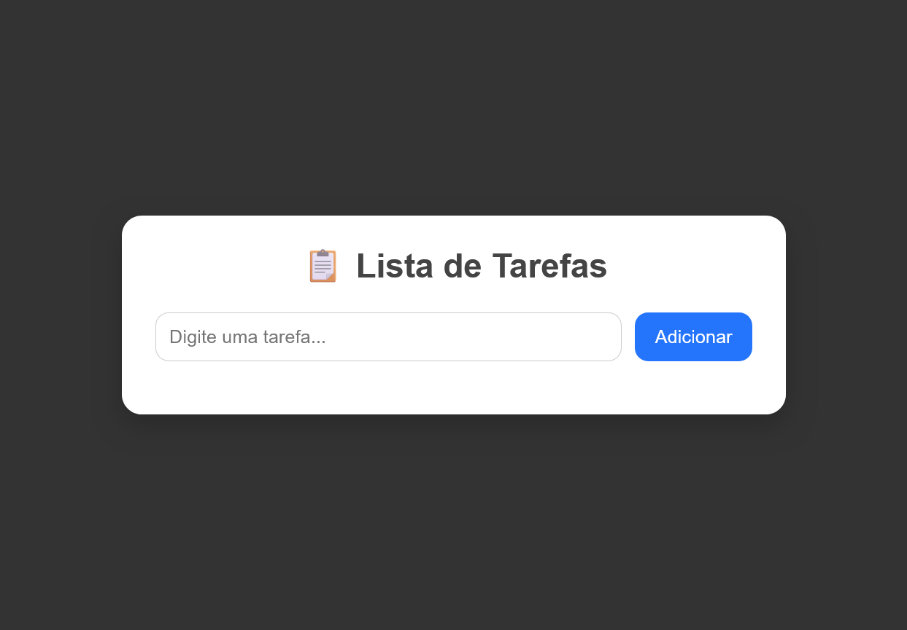

# 📋 Lista de Tarefas

## ✨ Descrição do Projeto

A **Lista de Tarefas** é uma aplicação web simples que permite ao usuário **adicionar, editar, concluir e remover tarefas** do dia a dia.  
As tarefas são salvas no **LocalStorage**, garantindo que não se percam mesmo após atualizar ou fechar a página.  

---

## 🛠️ Funcionalidades

- ➕ Adicionar novas tarefas  
- ✏️ Editar tarefas existentes  
- ✅ Marcar tarefas como concluídas  
- ❌ Remover tarefas  
- 💾 Persistência de dados com **LocalStorage**  
- 📱 Layout responsivo para desktop, tablet e celular  

---

## 💻 Tecnologias Utilizadas

- **HTML5** – Estrutura da página  
- **CSS3** – Estilo e responsividade  
- **JavaScript (ES6)** – Lógica da aplicação e manipulação do DOM   
